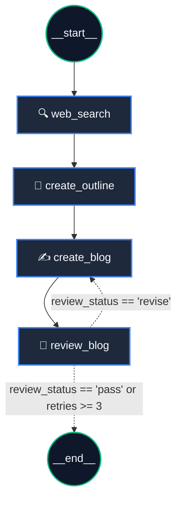

# ✍️ AI Agentic Blog Generator with Self-Correction & Live Web Research

[](https://github.com/langchain-ai/langgraph)
[](https://github.com/langchain-ai/langchain)
[](https://smith.langchain.com/)
[](https://groq.com/)
[](https://fastapi.tiangolo.com/)
[](https://streamlit.io/)
[](https://www.sqlalchemy.org/)
[](https://www.docker.com/)

---

## 🎬 Demo Video

https://github.com/user-attachments/assets/ddefa0ca-6033-44ac-8875-4ac8a923c652

---

## 📌 Project Overview

**AI Agentic Blog Generator** is an autonomous content creation system built using **LangGraph**, **FastAPI**, and **Streamlit**. Unlike standard one-shot prompt chains, this agent utilizes **live web research** to ground its writing in current facts and incorporates a **Cyclical Critic / Self-Correction loop** to evaluate, critique, and autonomously refine drafts before final output.

---

## ✨ Key Features

- **🔍 Live Web Research & Fact Extraction**: Integrates DuckDuckGo search to retrieve real-time facts, news, and source links.
- **📝 Structured Outline Generation**: Synthesizes search findings into a coherent, structured blog outline.
- **✍️ Deep Analytical Blog Drafting**: Generates comprehensive, fact-grounded articles strictly following the generated outline.
- **🔄 Cyclical Critic & Self-Correction Node**: An editorial LLM critic autonomously assesses drafts against outline completeness, tone, and formatting. If quality standards aren't met, it loops back with actionable feedback to rewrite and polish the post.
- **⚡ Real-Time Token Streaming**: Full streaming pipeline from LangGraph nodes through FastAPI `StreamingResponse` directly to Streamlit's `st.write_stream()`.
- **💾 Persistent Blog Archive**: Stores topics, outlines, final articles, source URLs, and timestamps using SQLAlchemy and SQLite.
- **🖥️ Modern Streamlit UI**: Intuitive interface with past blog history navigation, single-click deletion, source inspection, and instant generation.

---

## 🧠 System Architecture & Workflow



---

## 🛠️ Detailed Tech Stack

| Component | Technology | Description |
| :--- | :--- | :--- |
| **Agentic Orchestration** | [LangGraph](https://github.com/langchain-ai/langgraph) | State graph orchestration, state reducers (`TypedDict`), cyclical loops, and conditional routing. |
| **LLM Framework** | [LangChain](https://github.com/langchain-ai/langchain) | Prompt chaining, tool integration, and message streaming. |
| **Observability & Tracing** | [LangSmith](https://smith.langchain.com/) | Real-time monitoring, step-by-step LLM call inspection, token usage, and graph latency tracing. |
| **LLM Inference Engine** | [ChatGroq](https://groq.com/) | High-speed inference using state-of-the-art open-source LLMs. |
| **Structured Output** | [Pydantic v2](https://docs.pydantic.dev/) | Strict JSON schema validation for the critic evaluation model (`ReviewLLMOutPut`). |
| **Web Research** | [DuckDuckGo Search](https://duckduckgo.com/) | Real-time live web search and link harvesting via `DuckDuckGoSearchResults`. |
| **Backend REST API** | [FastAPI](https://fastapi.tiangolo.com/) | Asynchronous API endpoints with chunked HTTP streaming (`StreamingResponse`). |
| **ASGI Server** | [Uvicorn](https://www.uvicorn.org/) | High-performance ASGI server for FastAPI. |
| **Database & ORM** | [SQLAlchemy](https://www.sqlalchemy.org/) + [SQLite](https://www.sqlite.org/) | Relational database storage for generated blogs, outlines, sources, and metadata. |
| **Frontend UI** | [Streamlit](https://streamlit.io/) | Interactive dashboard with live token streaming, sidebar history, and markdown viewer. |
| **Environment Config** | [python-dotenv](https://github.com/theskumar/python-dotenv) | Environment variable management (`GROQ_API_KEY`, `SQL_DB_URL`, `BACKEND_URL`). |

---

## 📂 Project Structure

```text
GenerateBlog/
├── .github/
│   └── workflows/
│       └── ci.yml               # GitHub Actions CI automated pipeline
├── backend/
│   ├── __init__.py
│   ├── blog_fastapi.py          # FastAPI REST server with CORS & streaming
│   └── blog_generation.py       # LangGraph agentic self-correction graph
├── database/
│   ├── __init__.py
│   ├── blog_database.py         # SQLAlchemy ORM models & session
│   └── blogs_database.db        # SQLite database (gitignored)
├── frontend/
│   └── app.py                   # Streamlit web interface
├── tests/
│   ├── __init__.py
│   ├── test_api.py              # FastAPI endpoint tests
│   └── test_database.py         # Database CRUD unit tests
├── .dockerignore                # Excludes .venv, __pycache__, .env
├── .env.example                 # Environment variables template
├── .gitignore                   # Python, SQLite & environment exclusions
├── docker-compose.yml           # Multi-container orchestration
├── Dockerfile.backend           # Backend container image
├── Dockerfile.frontend          # Frontend container image
├── LICENSE                      # MIT License
├── README.md                    # Documentation with video & architecture
└── requirements.txt             # Pinned, production dependencies
```

---

## 🚀 Getting Started (Local Setup)

### 1. Prerequisites
- Python `3.10` or higher
- A Groq API Key ([Get a free key here](https://console.groq.com/keys))

### 2. Clone Repository & Setup Virtual Environment
```bash
# Clone the repository
git clone https://github.com/mrsaurabhtanwar/GenerateBlog.git
cd GenerateBlog

# Create and activate virtual environment
python -m venv venv

# Windows:
.\venv\Scripts\activate

# macOS / Linux:
source venv/bin/activate
```

### 3. Install Dependencies
```bash
pip install -r requirements.txt
```

### 4. Configure Environment Variables
Create a `.env` file in the root directory:
```env
GROQ_API_KEY=your_groq_api_key_here
SQL_DB_URL=sqlite:///database/blogs_database.db
BACKEND_URL=http://127.0.0.1:8000
```

---

## 🖥️ Running the Application

### Step 1: Start the FastAPI Backend
In your first terminal window:
```bash
uvicorn backend.blog_fastapi:app --reload --port 8000
```
- **API Server:** `http://127.0.0.1:8000`
- **Interactive Swagger Docs:** `http://127.0.0.1:8000/docs`

### Step 2: Start the Streamlit Frontend
In a second terminal window:
```bash
streamlit run frontend/app.py
```
- **Web Interface:** `http://localhost:8501`

---

## 🐳 Running with Docker (Optional)

Run the full-stack system with one command using Docker Compose:

```bash
docker compose up --build
```
- **Streamlit Frontend:** `http://localhost:8501`
- **FastAPI Backend:** `http://localhost:8000`

---

## 📡 API Endpoints

| Method | Endpoint | Description |
| :--- | :--- | :--- |
| `GET` | `/` | API health check. |
| `POST` | `/write-blog` | Streams real-time blog generation tokens and saves the final result. |
| `GET` | `/blog-ids` | Retrieves list of all saved blogs with IDs and topics. |
| `GET` | `/blog-ids/{blog_id}` | Fetches detailed blog data (outline, text, sources, date). |
| `DELETE` | `/delete-blog/{blog_id}` | Deletes a blog from SQLite database. |

---

##  License

Licensed under the [MIT License](LICENSE).
